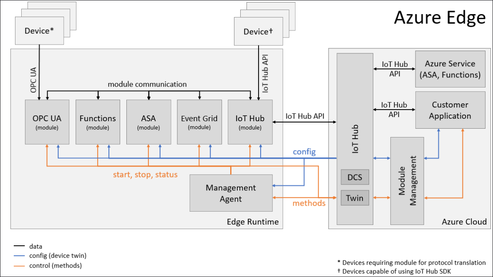

Azure IoT Edge Design
=====================

Azure IoT
---------

Composition:

- [Azure IoT Hub](https://azure.microsoft.com/en-us/services/iot-hub/)
- Azure IoT Edge
  - EdgeDevice_1_of_n
    - [EdgeRuntime](#edge-runtime)
      - [Module Management Agent](#module-management-agent)
      - [Edge Hub](#edge-hub)
    - Modules
      - Azure Functions
      - Azure Streaming Analytics
      - OPC UA
      - [UserDefinedModule_1_of_n](#user-defined-modules)

Architecture Diagram:

Edge Runtime
------------

The IoT Edge Runtime manages high-value services running on devices and enables communication between them. It allows workflows running on devices to be configured, deployed and monitored from the cloud - securely and at scale.

### Module Management Agent

  The module management agent is designed to communicate with IoT Hub in order to manage the state of the Edge device (install, launch and monitor modules).
  
#### Assemblies

- **Microsoft.Azure.Devices.Edge.Agent.Core**

  The core functionality of the module management agent

- **Microsoft.Azure.Devices.Edge.Agent.Docker**

  Docker is the first of several underlying technologies used to support module management.

- **Microsoft.Azure.Devices.Edge.Agent.IoTHub**

  IoT Hub hosts the device twin of the module management agent. Through the model of eventual consistency, the IoT Hub twin acts as an interactive configuration interface for the module management agent.

- **Microsoft.Azure.Devices.Edge.Agent.Service**

  The service is a long-running application that hosts the module management agent.

### Edge Hub

#### Assemblies

- **Microsoft.Azure.Devices.Hub.CloudProxy**

  The backing conduit to Azure IoT Hub. The cloud proxy will deliver all messages between the Edge Hub and the Azure IoT Hub.

- **Microsoft.Azure.Devices.Hub.Core**

  The core functionality of the edge hub

- **Microsoft.Azure.Devices.Hub.Http**

  The HTTP head allows modules to invoke direct methods on other modules. Previously, such functionality was only available through the cloud service, down to devices.

- **Microsoft.Azure.Devices.Hub.Mqtt**

  The MQTT head allows devices and modules that would typically communicate directly with the Azure IoT Hub via MQTT, to communicate with/through the Edge Hub instead.

- **Microsoft.Azure.Devices.Hub.Service**

  The service is a long-running application that hosts the module management agent.

- **Microsoft.Azure.Devices.Routing.Core**

  The routing core is an engine that receives every message generated by any module or device connected to the Edge Hub. Based on routes provided to the Edge Hub’s twin (or a configuration json-file supplied during launch), it will determine the end-point(s) of all messages generated by the modules.

### Edge Utility Library

#### Assemblies

- **Microsoft.Azure.Devices.Edge.Util**

  The utilities found in the Edge Util assembly provide components that enable patterns and practices common in other languages but not native to C#.

  - ##### `Option` type

    In many cases, `null` is used to represent an optional value, particularly in public APIs. The problem with this approach is that there is no way to determine, or specify, via the type signature of a function or method that the return value is optional. In these cases we should use the [`Option`](https://en.wikipedia.org/wiki/Option_type) type to handle cases where a value may be optional. This makes optional return values explicit and aides the consumer of the API in dealing with the fact that the result of a function may not have a value.

    > ***NOTE:** We have brought over an implementation of the `Option` type from the IoT Hub project, which is modeled after Scala's option type.*

User-defined Modules
--------------------

User-defined modules allow companies or individuals to create custom or tailored solutions specific to their needs which can be managed by the Edge Runtime. User-defined modules communicate with the Azure IoT Hub via the Edge Hub, and are deployed, configured and managed via the Module Management Agent.

> For information about developing user-defined modules, please view the [*Specification for Edge Runtime Configuration*](./EdgeRuntimeConfigSpec.md).

### Example Modules

- **BLE Module**

  This Azure Edge sample showcases how one can take an existing IoT Gateway module that interacts with physical hardware, package it into a container and have it interact with the Edge runtime.

  > Click [here](../edge-modules/ble/README.md) to view the module documentation...
